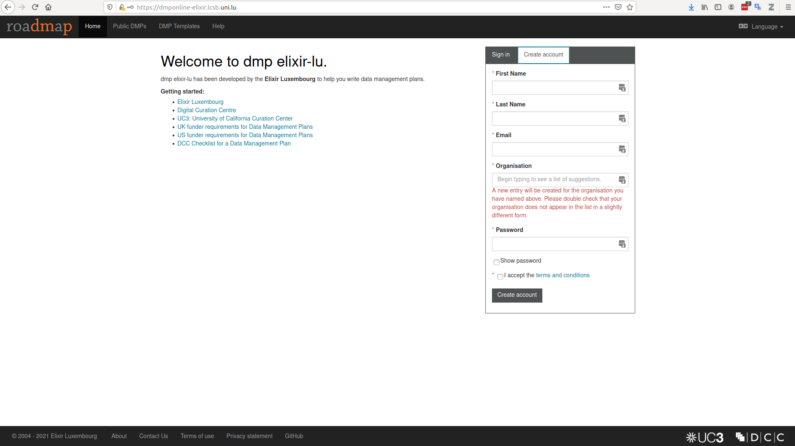
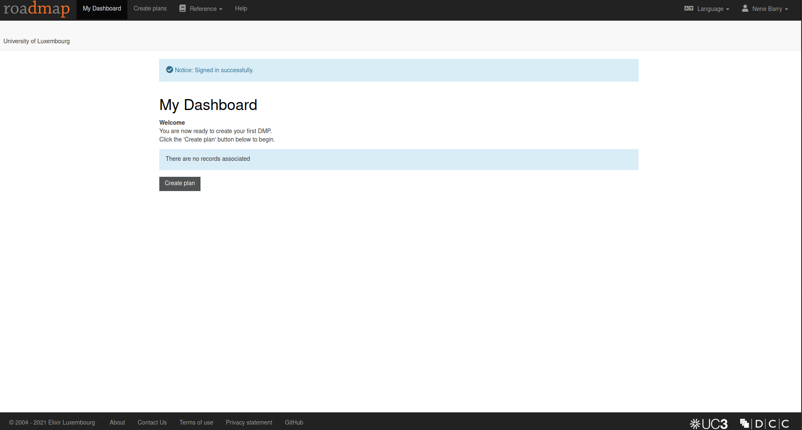
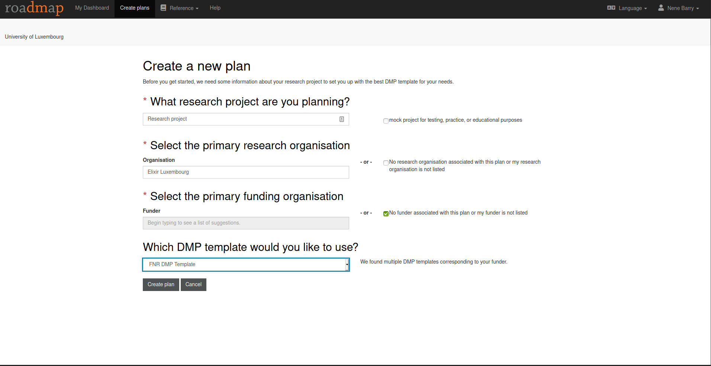
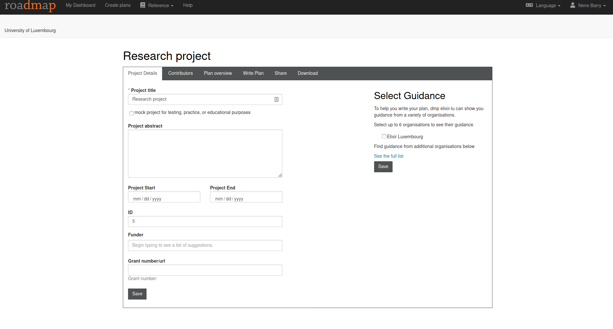
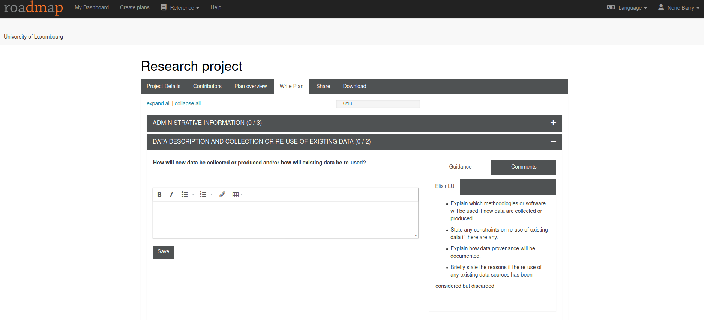
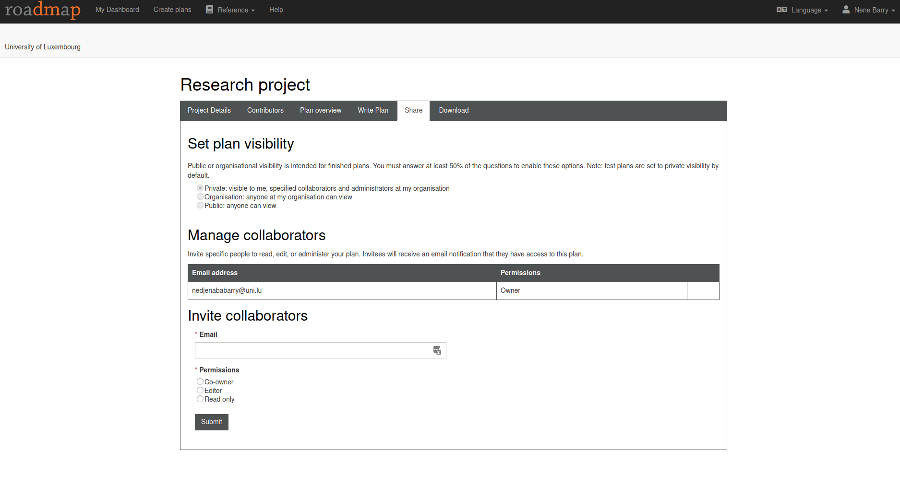
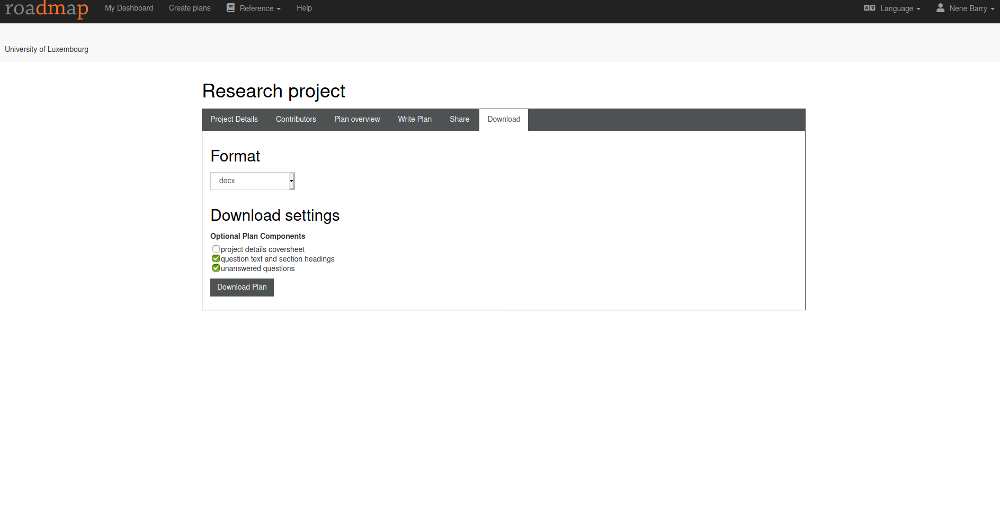

# Practical with the DMPonline

The Dmponline tool allows you to write, review and share your data management plan according to the requirements of your research project. In this practical, you will complete a questionnaire based on the FNR template whose policy is aligned with the core requirements for data management plans as defined in the [Science Europe practical guide to the international alignment of Research Data Management](https://www.scienceeurope.org/our-resources/practical-guide-to-the-international-alignment-of-research-data-management/).Considering these different questions as a guide to meet the needs and specifics of your project.

## Required material

Before starting the practical, make sure you have the following ready:

* The [example scenario](https://github.com/elixir-luxembourg/DS-DM-training/blob/master/resources/DM-DP_RunningExample.pdf) for our workshop.
* The URL [link](https://dmponline-elixir.lcsb.uni.lu/) for DmpOnline instance.

## Step 1: Create your account

* Go to the training URL link , and on the top right, select the "Create account" button. You must be on VPN.
* Provide the required informations and create your account. For the organisation, start typing the name of your organisation and make a selection from the list that appears, for example: "University of Luxembourg". If your organisation does not appear in the list, an organisation will be created under the name you would enter.        

## Step 2 : create your plan

* Login to Dmponline, and you will be on the " My Dashboard " page, you can choose the language you want.
* to start creating your Plan, click on the button "create plans " on the top menu or " create plan " on the botton of the Dashboard.       
* Enter the title of the project, the primary organisation: to have access to the FNR DMP template, select "Elixir Luxembourg", and your primary funder: tick the box “No funder associated with this plan”. After That, you will be asked which template you would like to use, select the FNR DMP template.        
* The next page will show you different features that will allow you to edit your plan (project details, adding contributors and your plan overview). The plan overview will show you the context of your DMP plan, the different sections with questions that will allow you to refine the writing of your DMP.        
* For each section you have several questions, and for each question, as you can see on the left menu, the tool gives guidance on the content of the answers you can bring. It also provides a "comments" part, in which you can add comments to share with your colaborators.        
*  Do not forget to save your answers from time to time.

## Step 3 : Share and download your plan.

* After completing the questionnaire, click on the "share" button on the top menu. The plan is automatically set to private. You can share it with your collaborators by adding their email, while defining the rights you wish to grant them (co-owner, editor, read-only). Click on the "submit" button when finished.        
* You can download your plan in the desired format by clicking on the "download" button.        

